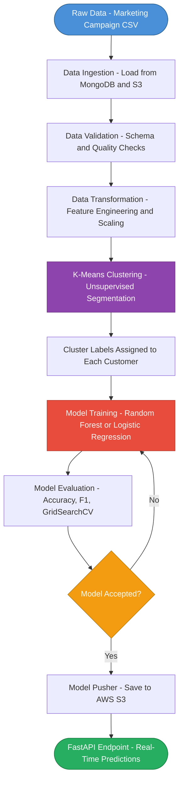
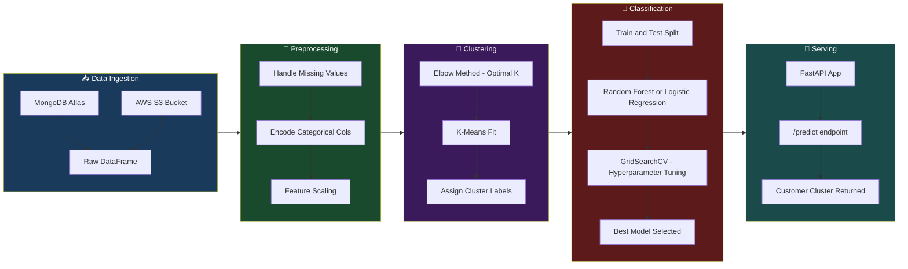
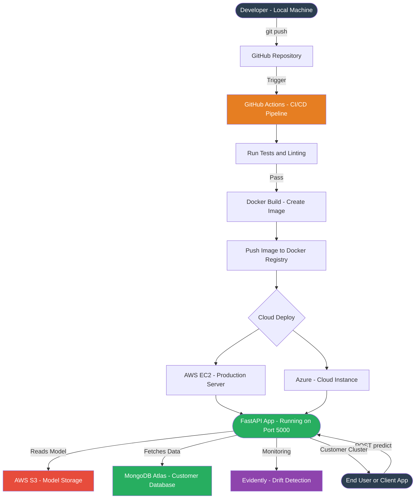
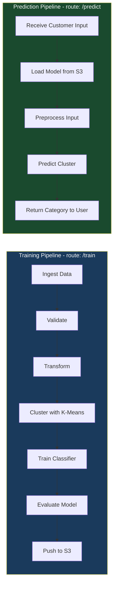

# 🛍️ CustomerIQ — Customer Categorization System

> **A complete end-to-end Machine Learning pipeline to predict and categorize customers based on their demographic and transactional data.**

<div align="center">


</div>

---

## 📌 Problem Statement

In today's competitive market, understanding your customer is everything. This project builds a machine learning system that predicts the **personality/category of a customer** using their personal and purchase details.

This is highly useful for:
- 🏬 Malls & retail stores
- 🛒 E-commerce platforms
- 🏢 Product-based companies

Based on a customer's **personal details** and **purchase behavior**, we:
1. **Cluster** them into meaningful segments using unsupervised learning
2. **Predict** the cluster of a new customer using classification techniques

---

## 💡 Solution Proposed

The approach leverages a full ML pipeline:
- Cluster existing customers using **K-Means**
- Train a **Random Forest / Logistic Regression** classifier on the labeled clusters
- Deploy the model as an API for real-time prediction

**GitHub Repository:** [PWskills-DataScienceTeam/Customer-Categorizer](https://github.com/PWskills-DataScienceTeam/Customer-Categorizer)

**Dataset:** [Marketing Campaign Dataset](https://github.com/entbappy/Branching-tutorial/blob/master/marketing_campaign.zip)

---

## 🔄 End-to-End Data Flow



---

## 🧠 ML Pipeline Architecture



---

## ☁️ Deployment Architecture



---

## 🔃 Training vs Prediction Pipeline



---

## 🧰 Tech Stack

| Category | Technology |
|---|---|
| Language | Python 3.7+ |
| ML Framework | Scikit-learn, XGBoost |
| API Framework | FastAPI + Uvicorn |
| Database | MongoDB (Atlas) |
| Cloud Storage | AWS S3 |
| Containerization | Docker |
| CI/CD | GitHub Actions |
| Cloud Platform | Azure / AWS |

---

## 📦 Libraries Used

| Library | Purpose |
|---|---|
| `scikit-learn` | ML algorithms (K-Means, Logistic Regression) |
| `xgboost` | High-performance gradient boosting |
| `fastapi` | REST API framework |
| `uvicorn` | ASGI server for FastAPI |
| `pymongo` | MongoDB driver for Python |
| `boto3` | AWS SDK – interact with S3, EC2 |
| `evidently` | ML model monitoring & data drift detection |
| `imbalanced-learn` | Handle imbalanced datasets (SMOTE) |
| `dill` | Enhanced Python object serialization |
| `python-dotenv` | Load environment variables from `.env` |
| `jinja2` | Templating engine for FastAPI |
| `python-multipart` | File upload support in APIs |
| `neuro_mf` | Neural network meta-feature extractor |
| `from-root` | Dynamic project root directory finder |
| `watchfiles` | Real-time file monitoring / auto-reload |

---

## 🗂️ Project Architecture

### `src/` — Main Package

```
src/
├── components/
│   ├── data_ingestion.py        # Load raw data from MongoDB / S3
│   ├── data_validation.py       # Schema & data quality checks
│   ├── data_transformation.py   # Feature engineering & preprocessing
│   ├── data_clustering.py       # K-Means clustering
│   ├── model_trainer.py         # Train classification model
│   ├── model_evaluation.py      # Evaluate model performance
│   └── model_pusher.py          # Push model to cloud storage
│
├── logger.py                    # Custom logging
├── exception.py                 # Custom exception handling
└── pipeline/
    ├── training_pipeline.py     # End-to-end training flow
    └── prediction_pipeline.py   # Real-time prediction flow
```

---

## 🤖 Models Used

| Stage | Model | Purpose |
|---|---|---|
| Clustering | **K-Means** | Segment customers into clusters |
| Classification | **Logistic Regression** / **Random Forest** | Predict cluster of new customers |
| Optimization | **GridSearchCV** | Hyperparameter tuning |

---

## ⚙️ How to Run

### Prerequisites
- MongoDB Atlas account with the dataset loaded
- AWS account (for S3 storage)
- Python 3.7+

### Step 1 — Clone the Repository

```bash
git clone https://github.com/sujalkhandelwal19-ds/CustomerIQ.git
cd CustomerIQ
```

### Step 2 — Create and Activate Virtual Environment

```bash
conda create --prefix venv python=3.7 -y
conda activate venv/
```

### Step 3 — Install Requirements

```bash
pip install -r requirements.txt
```

### Step 4 — Set Environment Variables

```bash
export AWS_ACCESS_KEY_ID=<your_aws_access_key>
export AWS_SECRET_ACCESS_KEY=<your_aws_secret_key>
export AWS_DEFAULT_REGION=<your_aws_region>
export MONGODB_URL=<your_mongodb_connection_string>
```

> 💡 On Windows, use `set` instead of `export`, or use a `.env` file with `python-dotenv`.

### Step 5 — Run the Application

```bash
python app.py
```

### Step 6 — Train the Model

```
GET http://localhost:5000/train
```

### Step 7 — Make Predictions

```
GET http://localhost:5000/predict
```

---

## 🐳 Docker Deployment

### Build the Docker Image

```bash
docker build \
  --build-arg AWS_ACCESS_KEY_ID=<AWS_ACCESS_KEY_ID> \
  --build-arg AWS_SECRET_ACCESS_KEY=<AWS_SECRET_ACCESS_KEY> \
  --build-arg AWS_DEFAULT_REGION=<AWS_DEFAULT_REGION> \
  --build-arg MONGODB_URL=<MONGODB_URL> \
  .
```

### Run the Container

```bash
docker run -d -p 5000:5000 <IMAGE_NAME>
```

---

## ☁️ Cloud & MLOps Infrastructure

| Component | Service |
|---|---|
| Model Storage | AWS S3 |
| Database | MongoDB Atlas |
| Deployment | Azure / AWS EC2 |
| CI/CD Pipeline | GitHub Actions |
| Experiment Tracking | Evidently (data drift) |

---

## ✅ Conclusion

The **CustomerIQ** system is a production-ready ML solution that:
- Segments customers intelligently using unsupervised learning
- Classifies new customers in real-time via a REST API
- Is fully containerized and deployable on cloud platforms
- Follows MLOps best practices with CI/CD, logging, and monitoring

---

<div align="center">
  <b>Built with ❤️ by the team | PW Skills</b>
</div>
